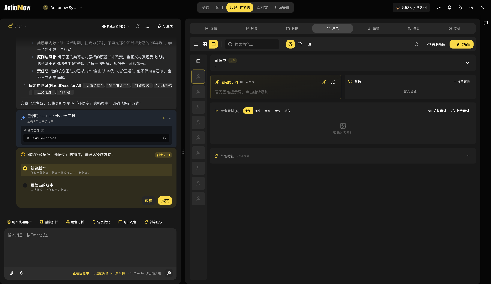
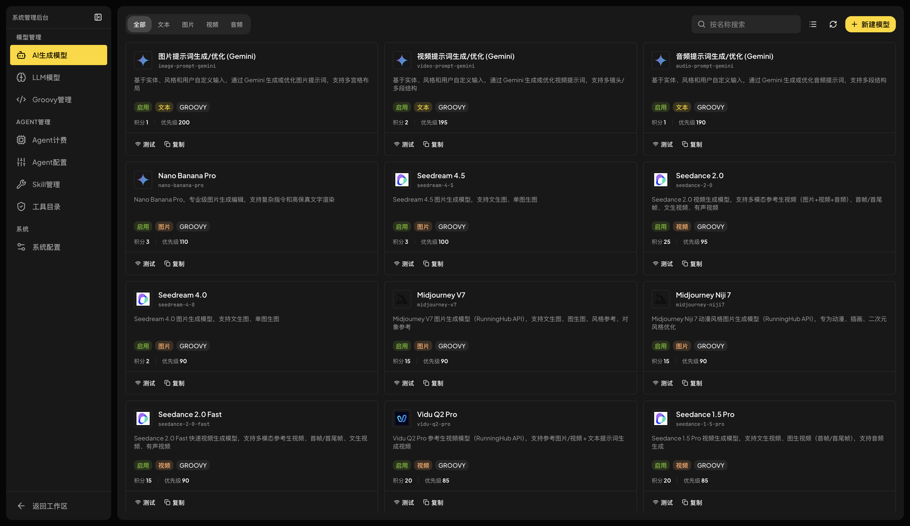
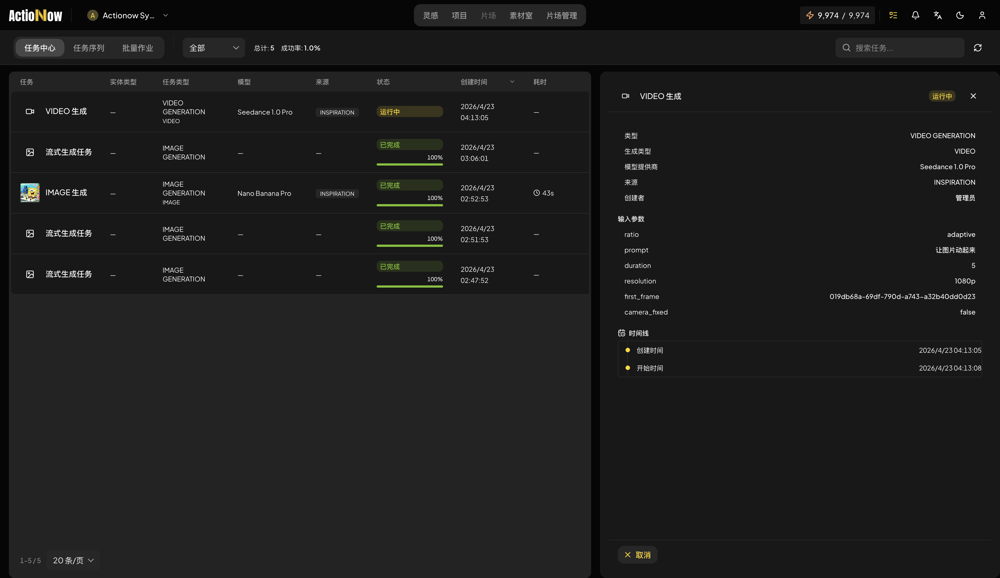
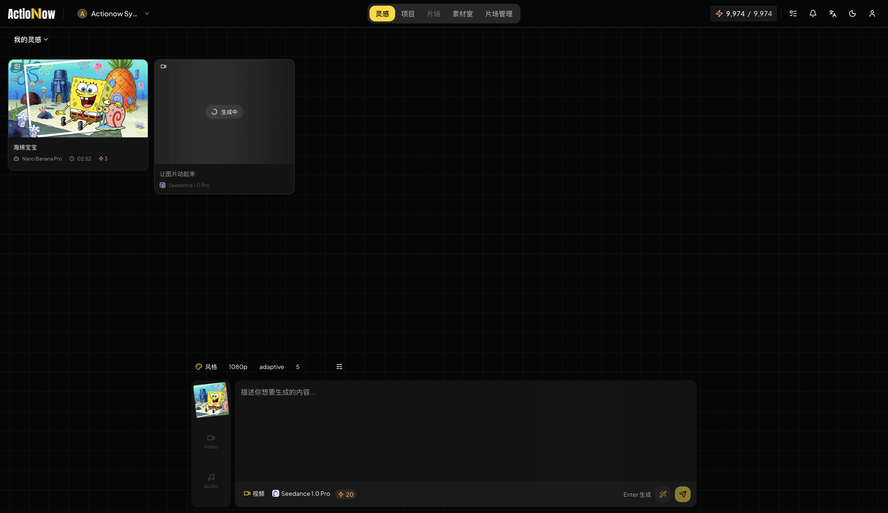
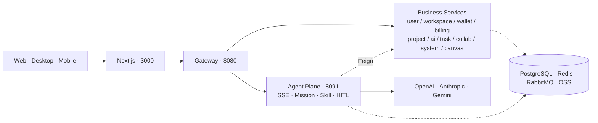

<div align="center">


<h3><i>Action! Now!</i> &nbsp;The open-source AI studio for screenwriting and storyboard production.</h3>

<p>从剧本到分镜，从角色到成片，Actionow 把"开拍 · 此刻"变成创意团队<br/>
触手可及的工程化工作台——智能体驱动，开箱即接最新模型，可代码级控制、可私有化部署。</p>

<p><a href="https://actionow.ai"><b>actionow.ai</b></a></p>

<p>
  <a href="LICENSE"></a>
  <a href="https://t.me/+m1saPHQZlTIxZDg1"></a>
  <a href="https://openjdk.org/projects/jdk/21/"></a>
  <a href="https://spring.io/projects/spring-boot"></a>
  <a href="https://spring.io/projects/spring-ai"></a>
  <a href="https://nextjs.org/"></a>
  <a href="https://react.dev/"></a>
  <a href="https://www.docker.com/"></a>
  
</p>

<p>
  <strong>中文</strong> ·
  <a href="README_EN.md">English</a>
</p>

<p>
  <a href="#产品定位">产品定位</a> ·
  <a href="#在线演示">在线演示</a> ·
  <a href="#核心能力">核心能力</a> ·
  <a href="#架构总览">架构总览</a> ·
  <a href="#快速开始">快速开始</a> ·
  <a href="#文档">文档</a> ·
  <a href="#roadmap">Roadmap</a>
</p>

</div>

---

## 产品定位

Actionow 面向剧本创编、分镜协作与 AIGC 成片这一完整生产链，提供一个由智能体驱动、可私有化部署的开源工作台。

平台围绕 **剧本 → 剧集 → 场次 → 分镜 → 角色、场景、道具、风格、素材** 的内容图谱组织所有创作行为，所有实体均带版本控制与血缘追踪，所有交互均可被智能体观察、复用与回放。

| 适用对象 |  |
|----------|----------|
| 影视、广告、动画团队 | 用智能体串联编剧、美术、制片，把分镜与素材沉淀为可复用资产 |
| AIGC 工作室 | 将多模态模型能力以 Skill 形式封装，按角色与场景组合调用 |
| 企业 AI 平台团队 | 以本项目为参考实现，构建自有的 Agent 中台与计费闭环 |
| AI 工程开发者 | 研究 Spring AI Alibaba Agent Framework 在多租户生产环境下的工程化落地 |

---

## 在线演示

线上体验：**[actionow.ai](https://actionow.ai)**

<div align="center">

<table>
  <tr>
    <td width="50%" align="center">
      <br/>
      <sub><b>Agent Chat</b></sub>
    </td>
    <td width="50%" align="center">
      <br/>
      <sub><b>Model Config</b></sub>
    </td>
  </tr>
  <tr>
    <td width="50%" align="center">
      <br/>
      <sub><b>Mission Console</b></sub>
    </td>
    <td width="50%" align="center">
      <br/>
      <sub><b>Inspiration</b></sub>
    </td>
  </tr>
</table>

</div>

---

## 核心能力

<table>
<tr>
<td width="50%" valign="top">

### 多 Agent 与自定义 Skill
Spring AI Alibaba 智能体编排，预置影视创作 Skill 库

- Mission 分步追踪 · SSE 实时进度
- JSON Schema 输出校验
- 三级 Skill 作用域：系统 / 工作空间 / 用户

</td>
<td width="50%" valign="top">

### 团队实时协作
WebSocket 多人协同，虚拟线程驱动高并发广播

- Presence 在线感知 + 实体排他编辑锁
- 完整协作生命周期事件
- 多浏览器标签页协同

</td>
</tr>
<tr>
<td width="50%" valign="top">

### 细粒度权限控制
工作空间 + 剧本两级权限模型

- Workspace：Creator / Admin / Member / Guest
- Script：VIEW / EDIT / ADMIN
- 临时授权 + 过期时间 + 来源追踪

</td>
<td width="50%" valign="top">

### 多租户架构
PostgreSQL Schema 级隔离

- 每工作空间独立 Schema
- TransmittableThreadLocal 异步链路传递
- 跨租户公共数据共享

</td>
</tr>
<tr>
<td width="50%" valign="top">

### 积分与计费系统
工作空间钱包 + 多渠道支付闭环

- 充值 / 消费 / 退款 / 转账 / 冻结全流水
- 成员配额 + 周期重置（日 / 周 / 月）
- Stripe + 微信支付 · Free / Basic / Pro / Enterprise

</td>
<td width="50%" valign="top">

### AI 模型插件化网关
Groovy 沙箱驱动的企业级模型网关

- **接入新模型无需发版**，写脚本即上线
- 四种响应模式：BLOCKING / STREAMING / CALLBACK / POLLING
- 重试 / 限流 / 熔断 / 超时 · Bearer / API Key / AK-SK

</td>
</tr>
<tr>
<td width="50%" valign="top">

### 异步任务编排
图片 / 视频 / 音频 / 文本统一异步执行框架

- 优先级队列 + BatchJob + Pipeline
- 超时 / 重试 / Compensation 回滚
- 全程关联积分扣费

</td>
<td width="50%" valign="top">

### 多 Provider 邮件网关
统一邮件抽象 + 运行时热切换

- Resend / SMTP（AWS SES）/ Cloudflare
- DynamicMailService 路由分发
- 验证码 / 重置 / 欢迎 / 安全告警模板

</td>
</tr>
<tr>
<td width="50%" valign="top">

### 内容图谱与版本管理
剧本 / 分镜 / 角色 / 素材统一建模

- 全量实体版本控制
- `t_asset_lineage` 资产血缘追踪
- 后端已建模画布节点 + 三种布局引擎

</td>
<td width="50%" valign="top">

### 多云对象存储抽象
一套接口，五家 Provider

- MinIO / AWS S3 / 阿里云 OSS
- Cloudflare R2 / 火山 TOS
- 配置驱动切换

</td>
</tr>
</table>

---

## 架构总览



完整拓扑、关键链路与技术选型见 **[docs/architecture.md](docs/architecture.md)**。

---

## 快速开始

```bash
git clone https://github.com/actionow-ai/actionow.git
cd actionow

./actionow.sh init        # 交互式生成 docker/.env.prod
./actionow.sh up          # 构建镜像并拉起完整生产栈
./actionow.sh status      # 查看容器状态
./actionow.sh backend rebuild xxx # 重新构建后端模块 ./actionow.sh backend rebuild ai
```

启动完成后访问：http://localhost:3000

> 本地开发、部署模式、命令参考见 [docs/development.md](docs/development.md)。

---

## 文档

| 主题           | 链接                                                        |
|----------------|-------------------------------------------------------------|
| 架构总览       | [docs/architecture.md](docs/architecture.md)                |
| 配置与端口     | [docs/configuration.md](docs/configuration.md)              |
| 本地开发与构建 | [docs/development.md](docs/development.md)                  |
| 工程结构       | [docs/project-structure.md](docs/project-structure.md)      |
| 参与贡献       | [CONTRIBUTING.md](CONTRIBUTING.md)                          |
| Docker 部署    | [docker/README.md](docker/README.md)                        |

---

## Roadmap

| 能力域                  | 目标说明                                                                                                                                  |
|-------------------------|-------------------------------------------------------------------------------------------------------------------------------------------|
| 企业级模型网关演进      | 已有 Groovy 沙箱支持**新模型零发版上线**（写脚本即可热加载），下一步引入租户级配额与计费、模型路由策略、灰度与 A/B、跨提供商降级、提示词版本管理与端到端调用链可观测 |
| 无限画布系统            | 升级为高性能视口、分层渲染、节点分组、模板化布局与多画布并行                                                                              |
| 团队协作增强            | 实时光标与评论、批注线程、多人编辑的冲突合并、活动时间线与通知中心，进一步丰富现有 Presence 与编辑锁体系                                  |
| 在线视频编辑与渲染      | 时间轴、镜头级剪辑、转场与字幕，云端渲染流水线与素材版本联动                                                                              |
| 图片编辑能力完善        | 蒙版、局部重绘、图层、参考图管理；与 Agent 工具链打通以支持"边生成边编辑"                                                                |
| 社区系统                | 用户主页、作品广场、Skill 与模板分享、点赞与订阅                                                                                          |
| 一键成片 Agent          | 由主题或大纲出发，自动完成剧本、角色、分镜、素材、成片的端到端编排                                                                        |
| 自主学习 Agent 体系     | 长期记忆与偏好沉淀、Agent 自我评估、技能自动演进与回归测试                                                                                |
| Skill Marketplace       | 在已有的系统级与工作空间级作用域之上，建设公开市场与版本化分发机制，引入签名、权限模型、依赖声明与跨工作空间安装                            |
| 国际化                  | 错误码、系统提示、邮件模板、Skill 与 Agent 提示词的多语言体系                                                                             |

---

## License

本仓库基于 [Apache License 2.0 的修改版本](LICENSE) 发布，附带若干额外条款（多租户商用与前端 LOGO/版权保护等）。商用前请仔细阅读 [LICENSE](LICENSE)。

## 社区

- Telegram 群组：[加入 Actionow 社区](https://t.me/+m1saPHQZlTIxZDg1)
- Issues：缺陷与功能请求
- Email：`support@actionow.ai`
- Security：`security@actionow.ai`
- Website：[actionow.ai](https://actionow.ai)

## 友情链接

- [LINUX DO](https://linux.do/) — 新的理想型社区

---

<div align="center">


<sub><b>Actionow</b> · Crafted for filmmakers, by engineers.</sub>

<sub><a href="https://actionow.ai">actionow.ai</a></sub>

</div>
