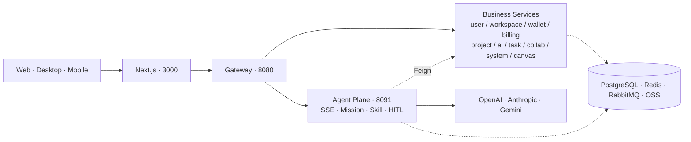

<div align="center">


<h3><i>Action — Now.</i> &nbsp;The open-source AI studio for screenwriting and storyboard production.</h3>

<p>From script to storyboard, from character to final cut — Actionow turns the<br/>
director's call to <i>action, now</i> into an engineering-grade, agent-driven,<br/>
self-hostable workspace for creative teams — onboard the latest models without a release.</p>

<p><a href="https://actionow.ai"><b>actionow.ai</b></a></p>

<p>
  <a href="LICENSE"></a>
  <a href="https://t.me/+m1saPHQZlTIxZDg1"></a>
  <a href="https://openjdk.org/projects/jdk/21/"></a>
  <a href="https://spring.io/projects/spring-boot"></a>
  <a href="https://spring.io/projects/spring-ai"></a>
  <a href="https://nextjs.org/"></a>
  <a href="https://react.dev/"></a>
  <a href="https://www.docker.com/"></a>
  
</p>

<p>
  <a href="README.md">中文</a> ·
  <strong>English</strong>
</p>

<p>
  <a href="#why-actionow">Why Actionow</a> ·
  <a href="#demo">Demo</a> ·
  <a href="#capabilities">Capabilities</a> ·
  <a href="#architecture">Architecture</a> ·
  <a href="#quick-start">Quick Start</a> ·
  <a href="#documentation">Docs</a> ·
  <a href="#roadmap">Roadmap</a>
</p>

</div>

---

## Why Actionow

Actionow targets the full pipeline of screenwriting, storyboard collaboration, and AIGC production with an agent-driven, self-hostable open-source workspace.

The platform organizes every creative action around the content graph **Script → Episode → Scene → Storyboard → Character / Prop / Style / Asset**. Every entity is versioned and lineage-tracked; every interaction is observable, replayable, and reusable by agents.

| Audience                       |                                                                                                                     |
|--------------------------------|---------------------------------------------------------------------------------------------------------------------|
| Film, ad, and animation teams  | Connect writers, art, and production through agents; turn storyboards and assets into reusable inventory.           |
| AIGC studios                   | Wrap multimodal model capabilities as Skills and compose them per character or scene.                               |
| Enterprise AI platform teams   | Use this project as a reference implementation for an in-house Agent platform with a billing closed loop.           |
| AI engineers                   | Study how the Spring AI Alibaba Agent Framework can be productized in a multi-tenant environment.                   |

---

## Demo

Live: **[actionow.ai](https://actionow.ai)**

<div align="center">

<table>
  <tr>
    <td width="50%" align="center">
      <br/>
      <sub><b>Agent Chat</b></sub>
    </td>
    <td width="50%" align="center">
      <br/>
      <sub><b>Model Config</b></sub>
    </td>
  </tr>
  <tr>
    <td width="50%" align="center">
      <br/>
      <sub><b>Mission Console</b></sub>
    </td>
    <td width="50%" align="center">
      <br/>
      <sub><b>Inspiration</b></sub>
    </td>
  </tr>
</table>

</div>

---

## Capabilities

<table>
<tr>
<td width="50%" valign="top">

### Multi-agent & custom Skills
Spring AI Alibaba orchestration with a built-in Skill library

- Mission tracing · live SSE progress
- JSON Schema output validation
- Three Skill scopes: system / workspace / user

</td>
<td width="50%" valign="top">

### Real-time team collaboration
WebSocket co-editing on Java virtual threads

- Workspace presence + entity edit locks
- Full collaboration lifecycle events
- Multi-tab session management

</td>
</tr>
<tr>
<td width="50%" valign="top">

### Fine-grained access control
Workspace + Script two-tier permission model

- Workspace: Creator / Admin / Member / Guest
- Script: VIEW / EDIT / ADMIN
- Temporary grants with expiry and provenance

</td>
<td width="50%" valign="top">

### Multi-tenant architecture
PostgreSQL Schema-level isolation

- Dedicated Schema per workspace
- TransmittableThreadLocal context propagation
- Shared schema for cross-tenant data

</td>
</tr>
<tr>
<td width="50%" valign="top">

### Credits & billing
Workspace wallet with multi-channel payments

- Recharge / spend / refund / transfer / freeze ledger
- Per-member quota with daily / weekly / monthly reset
- Stripe + WeChat Pay · Free / Basic / Pro / Enterprise

</td>
<td width="50%" valign="top">

### Pluggable AI model gateway
Enterprise model gateway powered by a Groovy sandbox

- **Onboard new models without a release** — just write a script
- Four response modes: BLOCKING / STREAMING / CALLBACK / POLLING
- Retry · rate limit · circuit breaker · timeout · Bearer / API Key / AK-SK

</td>
</tr>
<tr>
<td width="50%" valign="top">

### Async task orchestration
Unified async runtime for image / video / audio / text

- Priority queue + BatchJob + Pipeline
- Timeout · retry · Compensation rollback
- End-to-end credit accounting

</td>
<td width="50%" valign="top">

### Multi-provider mail gateway
Unified mail abstraction, hot-swappable at runtime

- Resend / SMTP (AWS SES) / Cloudflare
- DynamicMailService routing
- Templates: verification / reset / welcome / security

</td>
</tr>
<tr>
<td width="50%" valign="top">

### Content graph & versioning
Unified models for scripts / storyboards / characters / assets

- Versioning across all entities
- `t_asset_lineage` for full asset lineage
- Backend already models canvas nodes + 3 layout engines

</td>
<td width="50%" valign="top">

### Multi-cloud object storage
One interface, five providers

- MinIO / AWS S3 / Aliyun OSS
- Cloudflare R2 / Volcengine TOS
- Switchable by configuration

</td>
</tr>
</table>

---

## Architecture



Full topology, critical paths, and tech stack are documented in **[docs/architecture.en.md](docs/architecture.en.md)**.

---

## Quick Start

```bash
git clone https://github.com/actionow-ai/actionow.git
cd actionow

./actionow.sh init        # interactive wizard for docker/.env.prod
./actionow.sh up          # build images and bring up the full production stack
./actionow.sh status      # container status
./actionow.sh backend rebuild xxx # rebuild a backend module, e.g. ./actionow.sh backend rebuild ai
```

Endpoints:

| Surface       | URL                                  |
|---------------|--------------------------------------|
| Web console   | http://localhost:3000                |
| API gateway   | http://localhost:8080/doc.html       |
| Agent Swagger | http://localhost:8091/swagger-ui.html|

> Local development, deployment modes, and command reference: [docs/development.en.md](docs/development.en.md).

---

## Documentation

| Topic                  | Link                                                              |
|------------------------|-------------------------------------------------------------------|
| Architecture           | [docs/architecture.en.md](docs/architecture.en.md)                |
| Configuration & ports  | [docs/configuration.en.md](docs/configuration.en.md)              |
| Development & build    | [docs/development.en.md](docs/development.en.md)                  |
| Repository layout      | [docs/project-structure.en.md](docs/project-structure.en.md)      |
| Contributing           | [CONTRIBUTING.en.md](CONTRIBUTING.en.md)                          |
| Docker deployment      | [docker/README.md](docker/README.md)                              |

---

## Roadmap

| Capability                        | Goal                                                                                                                          |
|-----------------------------------|-------------------------------------------------------------------------------------------------------------------------------|
| Enterprise model gateway evolution| The Groovy sandbox already supports **zero-release model onboarding** (write a script, hot-load it). Next: tenant-level quota & billing, routing strategies, gray release & A/B, cross-provider fallback, prompt version management, and end-to-end call-chain observability. |
| Infinite canvas                   | High-performance viewports, layered rendering, node grouping, layout templates, and parallel multi-canvas editing.            |
| Team collaboration                | Live cursors and comments, threaded annotations, multi-user conflict merging, activity timelines, and a notification center on top of the existing Presence + edit-lock system. |
| Online video editing              | Timeline, shot-level cutting, transitions and subtitles, plus a cloud rendering pipeline linked back to asset versions.       |
| Image editing                     | Masks, inpainting, layers, reference image management; integrated with the agent toolchain for "edit while generating".       |
| Community                         | User profiles, work showcase, sharing of Skills and templates, likes and subscriptions to grow the open source ecosystem.     |
| One-click film agent              | From a topic or outline, automate the end-to-end pipeline: script, characters, storyboard, assets, and final cut.             |
| Self-improving agent system       | Long-term memory and preferences distilled from sessions and user feedback; self-evaluation, skill evolution, and regression testing. |
| Skill Marketplace                 | Build a public marketplace and versioned distribution on top of the existing system-level and workspace-level Skill scopes, with signing, permission model, dependency declarations, and cross-workspace installation. |
| Internationalization              | Multi-language coverage of error codes, system prompts, mail templates, Skills, and agent prompts.                            |

---

## License

This repository is released under a [modified version of the Apache License 2.0](LICENSE) with additional conditions (covering multi-tenant commercial usage and frontend LOGO/copyright protections). Please review [LICENSE](LICENSE) carefully before commercial use.

## Community

- Telegram group: [Join the Actionow community](https://t.me/+m1saPHQZlTIxZDg1)
- Discussions: architecture and RFCs
- Issues: defects and feature requests
- Email: `support@actionow.ai`
- Security: `security@actionow.ai`
- Website: [actionow.ai](https://actionow.ai)

## Friendly Links

- [LINUX DO](https://linux.do/) — A new ideal-type community

---

<div align="center">


<sub><b>Actionow</b> · <i>Action — Now.</i> · Crafted for filmmakers, by engineers.</sub>

<sub><a href="https://actionow.ai">actionow.ai</a></sub>

</div>
