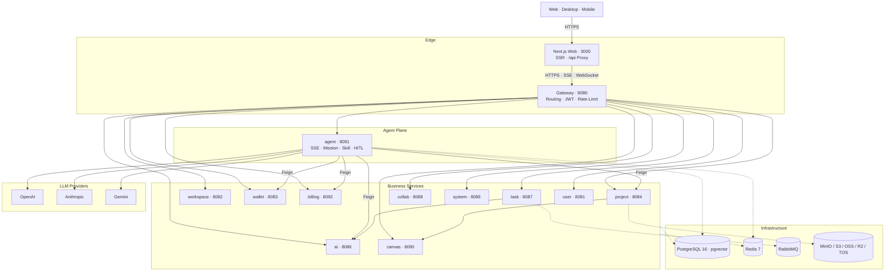

# Architecture

> [中文](architecture.md)

## System topology

## Critical paths

1. **Edge and proxy**: browser requests are forwarded by the Next.js `/api/[...path]` route to `gateway:8080`. CORS and mixed-content concerns are resolved at the gateway.
2. **Conversational generation**: the Agent service drives `scriptwriting/tools/*` through the ReAct loop, writing versioned entities to the Project service via Feign, while the Canvas service synchronizes node layout.
3. **Long-running tasks**: a Supervisor dispatches a Mission and a Runner executes step by step; progress is streamed over `/agent/missions/{id}/progress/stream`.
4. **Billing**: `AgentPreflightService` reserves quota with the Wallet at task start; `AgentTeardownService` writes back actual usage on completion.
5. **Context management**: `MicroCompactor` truncates oversized tool results into `WorkingMemoryStore`; `AutoCompactor` produces a CHECKPOINT summary once tokens reach the high-water mark.
6. **Zero-release model onboarding**: a new model is registered in the `actionow-ai` admin UI by writing a Groovy script (request build, response mapping, binding context). Saving the script triggers a sandbox hot-load and the model becomes callable across all tenants immediately — no restart, no redeploy.

## Tech stack

| Layer            | Choice                                                                                  |
|------------------|------------------------------------------------------------------------------------------|
| Frontend         | Next.js 16 (App Router, Standalone), React 19, HeroUI V3, Tailwind CSS 4, next-intl, Zustand |
| Editor           | CodeMirror 6, react-markdown with remark-gfm / math and rehype-highlight                 |
| Backend          | Java 21 (`--enable-preview`), Spring Boot 3.4.1, Spring Cloud 2024.0.0                   |
| AI framework     | Spring AI 1.1.2, Spring AI Alibaba Agent Framework 1.1.2.0                               |
| Service comm.    | Spring Cloud OpenFeign, LoadBalancer, Gateway                                            |
| Persistence      | PostgreSQL 16 (pgvector), MyBatis-Plus 3.5.9                                             |
| Cache & coord.   | Redis 7, Redisson 3.40                                                                   |
| Messaging        | RabbitMQ                                                                                  |
| Object storage   | MinIO, AWS S3, Aliyun OSS, Cloudflare R2, Volcengine TOS                                 |
| Auth             | JWT (jjwt 0.12.6)                                                                        |
| Templating       | Groovy 4 with groovy-sandbox (prompt template execution)                                 |
| Tooling          | Lombok, MapStruct, Hutool, Guava, Testcontainers, jtokkit                                |
| Deployment       | Docker Compose v2; PM2 and Cloudflare Workers optional for the frontend                  |
