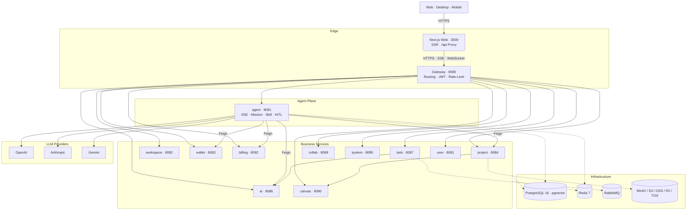

# 架构总览

> [English](architecture.en.md)

## 系统拓扑

## 关键链路

1. **入口与代理**：浏览器请求经 Next.js `/api/[...path]` 路由代理至 `gateway:8080`，跨域与混合内容问题在网关侧统一收敛。
2. **对话生成内容**：Agent 服务通过 ReAct 循环驱动 `scriptwriting/tools/*`，使用 Feign 写入 Project 服务的版本化实体，并由 Canvas 服务同步节点布局。
3. **长任务执行**：Supervisor 派发 Mission，Runner 步进执行，进度通过 `/agent/missions/{id}/progress/stream` SSE 推送。
4. **计费结算**：`AgentPreflightService` 在任务启动时向 Wallet 预扣配额，`AgentTeardownService` 在结束后回写实际用量。
5. **上下文管理**：`MicroCompactor` 截断超长工具结果并写入 `WorkingMemoryStore`；`AutoCompactor` 在 Token 达到水位线时生成 CHECKPOINT 摘要。
6. **新模型零发版上线**：在 `actionow-ai` 的可视化配置中创建 Provider 并写入 Groovy 脚本（请求构建、响应映射、绑定上下文），保存即由沙箱热加载并立即对全租户可调用，无需重启或重新发版。

## 技术选型

| 层级       | 选型                                                                                          |
|------------|------------------------------------------------------------------------------------------------|
| 前端       | Next.js 16（App Router、Standalone）、React 19、HeroUI V3、Tailwind CSS 4、next-intl、Zustand   |
| 编辑器     | CodeMirror 6、react-markdown 加 remark-gfm / math 与 rehype-highlight                          |
| 后端       | Java 21（启用 `--enable-preview`）、Spring Boot 3.4.1、Spring Cloud 2024.0.0                   |
| AI 框架    | Spring AI 1.1.2、Spring AI Alibaba Agent Framework 1.1.2.0                                    |
| 服务通信   | Spring Cloud OpenFeign、LoadBalancer、Gateway                                                  |
| 持久化     | PostgreSQL 16（pgvector）、MyBatis-Plus 3.5.9                                                  |
| 缓存与协调 | Redis 7、Redisson 3.40                                                                         |
| 消息       | RabbitMQ                                                                                       |
| 对象存储   | MinIO、AWS S3、阿里云 OSS、Cloudflare R2、火山 TOS                                             |
| 鉴权       | JWT（jjwt 0.12.6）                                                                             |
| 模板       | Groovy 4 加 groovy-sandbox（提示词模板执行）                                                   |
| 工具链     | Lombok、MapStruct、Hutool、Guava、Testcontainers、jtokkit                                      |
| 部署       | Docker Compose v2，前端可选 PM2 与 Cloudflare Workers                                          |
